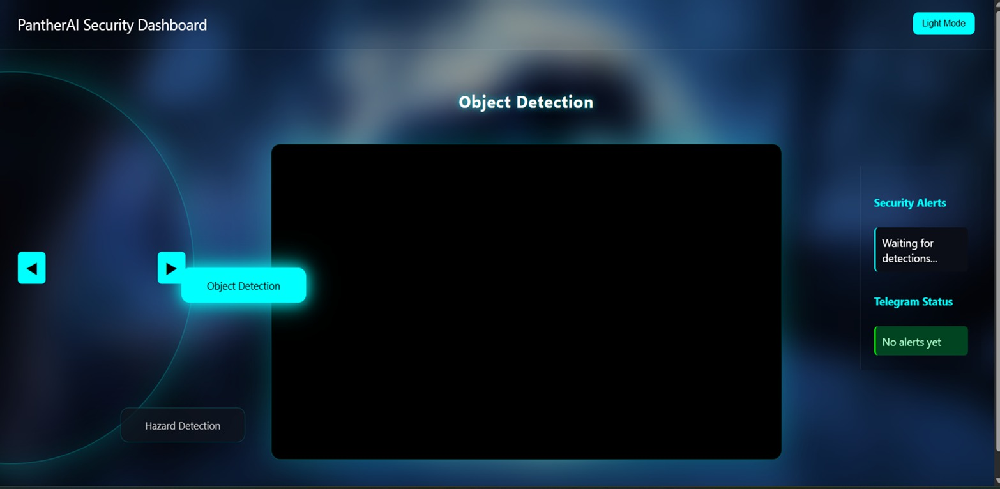
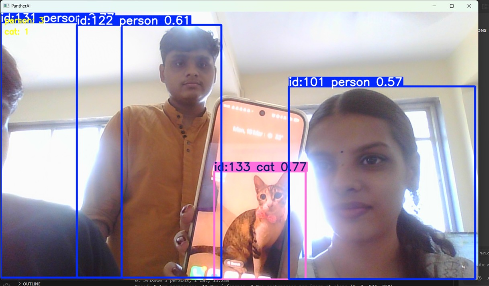
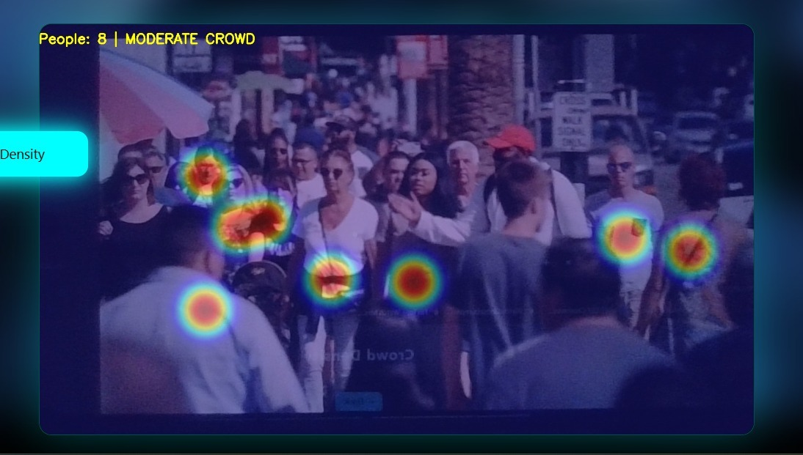
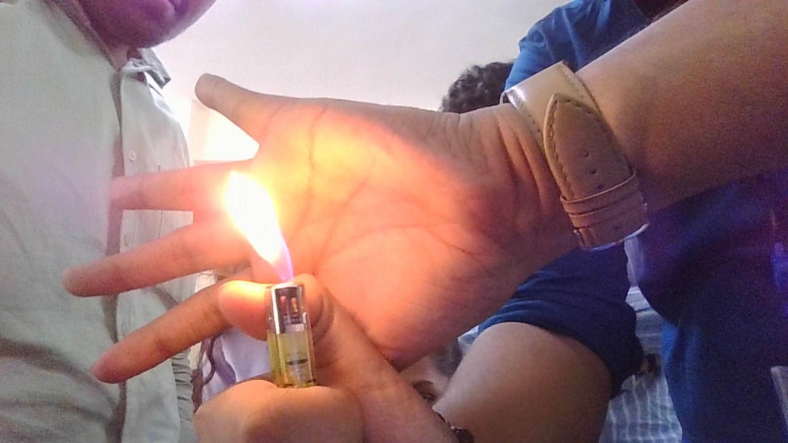

# 🤖 Real-Time Object Detection Using CNN

<div align="center">


### 🎯 Intelligent Real-Time Surveillance & Object Detection System

</div>

---

## 📌 Overview

The **Real-Time Object Detection Using CNN** is an intelligent surveillance and monitoring system designed to detect objects, identify potential threats, and provide real-time situational awareness from live video streams.

This project integrates **Deep Learning, Computer Vision, and Full-Stack Web Development** to deliver a scalable monitoring solution for real-world environments such as:

- 🏫 Educational campuses  
- 🏢 Corporate offices  
- 🚉 Transport hubs  
- 🏬 Shopping malls  
- 🌆 Public surveillance zones  

The system processes live video feeds, detects objects in real time, and presents insights through a responsive **web-based dashboard**.

---

## 🎯 Key Objectives

- Develop a real-time AI-based object detection system  
- Enable multi-object detection from live camera streams  
- Improve situational awareness using deep learning models  
- Integrate detection system with a web dashboard  
- Provide real-time alerts and monitoring capabilities  

---

## ⚙️ Key Features

### 🎥 Real-Time Detection
- Live camera and video stream processing
- Frame-by-frame object detection using deep learning models
- Optimized inference for real-time performance

### 🚨 Threat & Safety Monitoring
- Weapon detection for security alerts
- Fire detection for emergency response systems
- Crowd density analysis for risk assessment

### 📊 Smart Monitoring Dashboard
- Centralized multi-camera dashboard
- Live stream visualization
- Incident alerts and notifications panel
- Camera control and monitoring interface
- Analytics and detection logs

### 🔔 Alert System
- Real-time event logging
- Instant warning generation
- Notification-ready architecture (Telegram / API integration support)
- Incident history tracking

---

## 🧠 System Architecture

```text
Frontend Dashboard (React)
        ↓
REST API Layer (Flask Backend)
        ↓
AI Processing Engine (CNN / YOLO / OpenCV)
        ↓
Frame Processing Module
        ↓
Live Camera / Video Streams
```

---

## 🛠️ Technology Stack

### 🧠 Backend (AI Engine)
- Python
- Flask
- OpenCV
- CNN / YOLO Models
- NumPy
- Pandas

### 🌐 Frontend (Dashboard)
- React.js
- Vite
- JavaScript
- CSS3

### ⚙️ Core AI/ML Concepts
- Convolutional Neural Networks (CNN)
- Object Detection & Localization
- Feature Extraction
- Real-time Video Processing

### 🔧 Utilities
- Logging System
- Stream Handler
- Alert Manager
- Analytics Engine

---

## 📁 Project Structure

```bash
Real-Time-Object-Detection-Using-CNN/
│
├── Backend/
│   ├── app.py
│   ├── detector.py
│   ├── tracker.py
│   ├── weapon_detector.py
│   ├── fire_detector.py
│   ├── crowd_risk_analyzer.py
│   ├── analytics.py
│   └── utils/
│
├── Dashboard/
│   ├── public/
│   ├── src/
│   └── package.json
│
├── Streams/
│
├── requirements.txt
└── README.md
```

---

## 🔄 System Workflow

1. Live video stream captured from camera  
2. Frames extracted using OpenCV  
3. Frames passed into CNN/YOLO model  
4. Objects detected with bounding boxes  
5. Threat classification modules activated  
6. Results sent to backend API  
7. Dashboard updates in real time  

---

## 📸 System Screenshots

### 📊 PantherAI Dashboard


### 🎯 Live Object Detection


### 📊 Demo Of Crowd Detection


### 🚨 Alert System View


### 📊 Demo Of Weapon Detection


---

## 💼 Real-World Use Cases

- 🏙️ Smart City Surveillance Systems  
- 🏫 Campus Security Monitoring  
- 🚆 Railway & Metro Station Safety  
- 🏬 Mall & Airport Surveillance  
- 🏭 Industrial Safety Monitoring  
- 🔐 Restricted Area Protection Systems  

---

## 🚀 Future Enhancements

- 🔥 YOLOv8 upgrade for higher accuracy  
- 📱 Mobile app integration for alerts  
- ☁️ Cloud-based video processing system  
- 🤖 Face recognition module  
- 🌍 Multi-location surveillance control  
- 🧠 AI-based predictive threat analysis  
- 🔐 Role-based access control dashboard  

---

## 📊 Impact

This project demonstrates the integration of:

- Artificial Intelligence (Deep Learning)
- Computer Vision Systems
- Full-Stack Web Development
- Real-Time Data Processing

It simulates a **real-world industrial surveillance platform**, making it suitable for academic evaluation, internships, and recruitment portfolios.

---

## 👨‍💻 Author

**Ketki Devkar**  
B.E. Artificial Intelligence & Data Science  
GitHub: https://github.com/ketkidevkar  

---

## ⭐ Conclusion

This system represents a scalable AI-powered surveillance solution capable of real-time object detection and threat monitoring, bridging the gap between academic learning and industrial applications.

---

⭐ *Built with Deep Learning, Computer Vision, and Real-Time Intelligence Systems*
